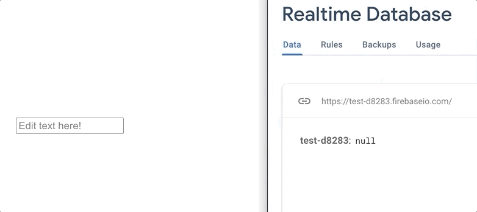
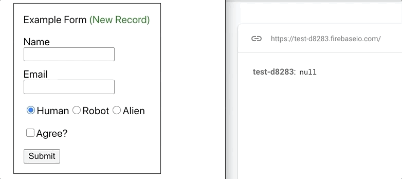

# react-firebase-input

> Sync inputs and forms from React to your Firebase realtime database  
[](https://www.npmjs.com/package/react-firebase-input) [](https://standardjs.com)  

On component mount, the values from your Firebase realtime database will set on your FirebaseInput components in react. As the user changes the input values they will update the values in the database. 
  

✅ Supports Forms  

If you want multiple inputs to submit simultaneously, wrap your inputs with the FirebaseForm component. 
   


See more examples and experiment with your own database:  
[Live Example](https://reidjs.github.io/react-firebase-input/)


## Install
npm  
```bash
npm install --save react-firebase-input
```

yarn  
```bash
yarn add react-firebase-input
```

## Usage

#### Inputs <FirebaseInput/>
- FirebaseInput props
  - dbRef: reference to firebase realtime database
  - refKey: specific key in the reference object
  - callback (optional): function that is called with the error result, or no params on success

```jsx
import React from 'react'
import firebaseDbInstance from '../your-project'
import { FirebaseInput }from 'react-firebase-input'

const Example = () => {
  const dbRef = firebaseDbInstance.ref('/school')

  return (
    <FirebaseInput
      dbRef={dbRef} 
      refKey="name"
      type="text"
    />
  )
}

```

Supports the following types:
- text 
- textarea
- radio
- checkbox
- number
- range
- password
- email
- tel

#### Forms <FirebaseForm/>
- FirebaseForm props
  - dbRef: reference to firebase realtime database
  - newRecord (optional): boolean, if true, will create a new record under the provided reference
  - callback (optional): function called with error result, or the key of the new object created 
  - *If you pass an onSubmit prop to the Form, it will over-ride most of this component's functionality*
- FirebaseForm children input props
  - refkey: key in the database object
  - value: value of the key in the database object

```jsx
import React, { useState } from 'react'
import firebaseDbInstance from '../your-project'
import { FirebaseForm }from 'react-firebase-input'

const Example = () => {
  const [name, setName] = useState('')
  const [email, setEmail] = useState('')

  const dbRef = firebaseDbInstance.ref('/user')

  return (
    <FirebaseForm dbRef={dbRef}>
      <div>Example Form</div>
      <div>Name</div>
      <input onChange={(e) => setName(e.target.value)} value={name} refkey="name" />
      <div>Email</div>
      {/* State doesn't have to be controlled by React*/}
      <input refkey="email" type="email" />
      <div>
        <div>Also supports nested inputs</div>
        <input refkey="agreeToTOS" type="checkbox"/>
      </div>
      <button>Submit</button>
    </FirebaseForm>
  )
}
```

## Development
1. Clone the git repo
2. cd `react-firebase-input`
3. `npm start`
4. Open a new terminal or tab
5. cd `react-firebase-input/example`
6. `npm start`
7. Open browser to localhost:3000

## License

MIT © [reidjs](https://github.com/reidjs)
