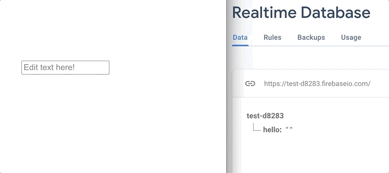
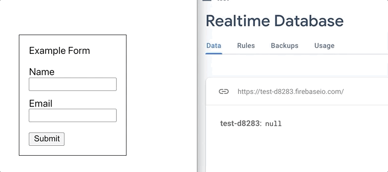

# react-firebase-input

> Sync inputs and forms from React to your Firebase realtime database


On component mount, the values from your Firebase realtime database will set on your FirebaseInput components in react. As the user changes the input values they will update the values in the database. 

🎉Now Supports Forms🎉  


If you want multiple inputs to submit simultaneously, wrap your inputs with the FirebaseForm component. 

See how it works:  
[Live Example](https://reidjs.github.io/react-firebase-input/)


[](https://www.npmjs.com/package/react-firebase-input) [](https://standardjs.com)

## Install
npm  
```bash
npm install --save react-firebase-input
```

yarn  
```bash
yarn add react-firebase-input
```

## Usage

#### Inputs <FirebaseInput/>
- FirebaseInput requires dbRef and refKey props
  - dbRef: reference to firebase realtime database
  - refKey: specific key in the reference object

```jsx
import React from 'react'
import firebaseDbInstance from '../your-project'
import { FirebaseInput }from 'react-firebase-input'

const Example = () => {
  const dbRef = firebaseDbInstance.ref('/school')

  return (
    <FirebaseInput
      dbRef={dbRef} 
      refKey="name"
      type="text"
    />
  )
}

```

Supports the following types 
- text 
- textarea
- radio
- checkbox
- number
- range
- password
- email
- tel

#### Forms <FirebaseForm/>
- FirebaseForm needs the dbRef instance as a prop
  - dbRef: reference to firebase realtime database
- Every input needs a refkey and a value prop
  - refkey: key in the database object
  - value: value of the key in the database object
- *Do not pass an onSubmit prop to the Form*

```jsx
import React, { useState } from 'react'
import firebaseDbInstance from '../your-project'
import { FirebaseForm }from 'react-firebase-input'

const Example = () => {
  const [name, setName] = useState('')
  const [email, setEmail] = useState('')

  const dbRef = firebaseDbInstance.ref('/user')

  return (
    <FirebaseForm dbRef={dbRef}>
      <div>Example Form</div>
      <div>Name</div>
      <input onChange={(e) => setName(e.target.value)} value={name} refkey="name" />
      <div>Email</div>
      <input onChange={(e) => setEmail(e.target.value)} value={email} refkey="email" type="email" />
      <button>Submit</button>
    </FirebaseForm>
  )
}
```

## TODO

- [ ] Support date type
- [ ] Test whether or not forms support checkboxes, radio buttons correctly

## License

MIT © [reidjs](https://github.com/reidjs)
